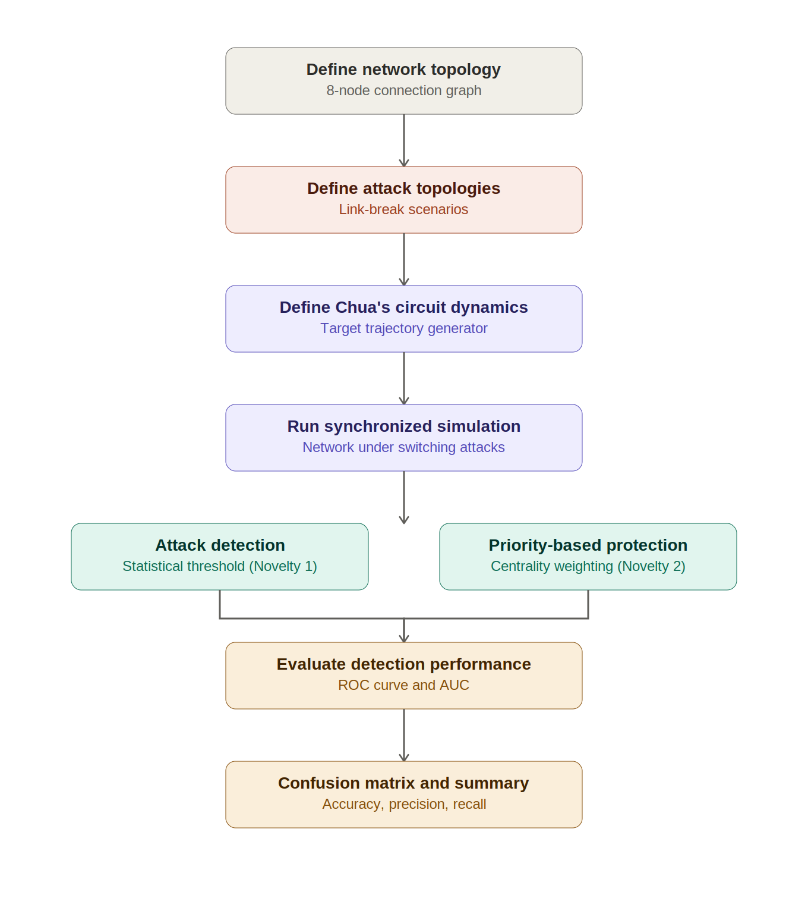

# Results

This folder contains the figures and visualizations generated by `CyberSec_2.ipynb`.

## Pipeline overview

High-level flow of the simulation: network topology → attack topologies →
Chua's circuit dynamics → synchronized simulation with attack detection and
priority-based protection → performance evaluation.

## Figures

| File | Description |
|------|-------------|
| `01_network_topology.png` | Base network graph — 8 nodes, normal connections |
| `02_attack_scenarios.png` | Four attack topology scenarios (a–d) with broken links |
| `03_priority_weights.png` | Node priority weights based on betweenness centrality |
| `04_target_trajectory.png` | Target trajectory of the isolated Chua's circuit node |
| `05_sync_performance.png` | Synchronization error, priority comparison, and detection timeline under attack |
| `06_roc_curve.png` | ROC curve and AUC for the attack detection module |
| `07_confusion_matrix.png` | Confusion matrix and detection metrics (accuracy, precision, recall, F1) |

## Key results

- **Attack detection AUC:** see `06_roc_curve.png` for the exact score
- **Detection accuracy / precision / recall / F1:** see `07_confusion_matrix.png`
- **Priority-based protection:** high-priority nodes (by centrality) synchronize faster and recover quicker after attacks, as shown in `05_sync_performance.png`

## Regenerating these figures

Run the final cell of `../CyberSec_2.ipynb` (labeled "Save All Figures") after
running the full notebook top to bottom. It will regenerate all files in this
folder.
